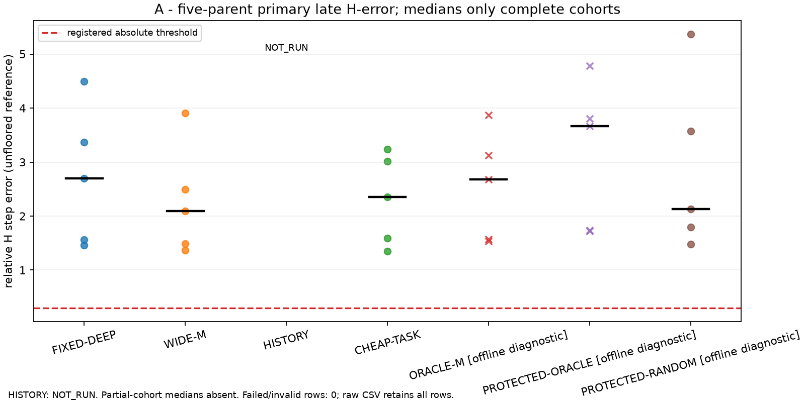

# A20-R1：晚态 seed anatomy 机制判别

**正式结论：D — INCONCLUSIVE。合法 enrichment 未通过 Gate B；闭环成像、history 消融及 NN 均为 NOT_RUN。** 这份公开包保存实现、有效负向结果、复现冲突和全部计费，不代表成像质量或部署加速 GO。

五个历史暴露的 Gaussian parents（2001、2005、2003、2007、2013）各六种 late-state 方法已完成，30 个 QP 全部通过原 KKT。所有实际 current rank 均为 56。

|方法|iteration17 median relative H-step error|角色|
|---|---:|---|
|FIXED-DEEP|269.5060%|O4/P4/M4，degree3，previous=None|
|WIDE-M|209.5953%|合法材料宽度扩充，O4/P4/M16，degree1|
|CHEAP-TASK|235.1696%|合法付费 reduced-gradient scaffold|
|HISTORY|NOT_RUN|快照没有该算法自身 accepted history|
|ORACLE-M|267.5646%|**ORACLE / OFFLINE / DIAGNOSTIC ONLY**|
|PROTECTED-ORACLE|366.1017%|**ORACLE / OFFLINE / DIAGNOSTIC ONLY**，完整保护六源 block|
|PROTECTED-RANDOM|213.2166%|同配置离线随机控制，排除候选排名|

受保护 oracle 的 KB current capture 接近 1，参考方向上的 Jacobian 误差中位数仅 **0.0486763%**，但整个 reduced GN 的最优步仍不忠实。这反对“仅注入一个理想材料方向就能修复晚态 GN”的简单解释；一条正向切线的准确性不能保证整个受约束二次模型及其最优解的准确性。

随后 2001/iteration0 的 FIXED-DEEP 相对历史步差 **1.670492e-6**，超过冻结的 **1e-9** baseline 复现门槛。旧/新 QP 都通过原 KKT，但严格复现失败，协议要求停止。实际构造 31 个候选：30 OK、1 FAILED；另外 29 个 NOT_RUN，十个 HISTORY 快照也为 NOT_RUN。六个已访问 full references 经重新审核有效，四个未访问 early references 不冒充已审核。没有重生成 teacher、调整容差、追加物理重跑或 full fallback。正式 oracle KILL 的前置条件没有全部满足，不能把描述性负向证据写成结论 C。

从 [中文机制报告](LATE_STATE_SEED_ANATOMY.md) 和 [最终 gate](GATE_DECISION.json) 开始；然后读 [oracle 诊断](ORACLE_MATERIAL_SEED_DIAGNOSTIC.md)、[rank/action 匹配](RANK_ACTION_MATCHING.md)、[history 信息审计](HISTORY_INFORMATION_AUDIT.md) 与 [闭环状态](CLOSED_LOOP_OPM_RESULTS.md)。[来源冲突](SOURCE_CONFLICTS.md) 区分已确认的 retained-U 接线差异与尚未证明的失配原因。

可复查证据包括 [原始逐方法/状态 JSONL](results/a20_r1/anatomy/rows.jsonl)、[完整 CSV](results/a20_r1/report/ANATOMY_RAW.csv)、[行动账本](COST_LEDGER.jsonl)、[失败/缺失账本](FAILURE_LEDGER.jsonl)、[图 A–D 及原始数据索引](results/a20_r1/report/REPORT_MANIFEST.json)。嵌套 span 和独立部署归因不重复加到账单；费用总额以 job/external inclusive receipts 为准，见 [最终累计预算](results/a20_r1/BUDGET_FINAL.json)。R1 GPU 占用 285.841439 秒，Phase2 为零；审核、失败、重渲染和公开包费用也计入 CPU。

[实现与复现合同](REPRODUCE_R1.md)、[公式—函数映射](FORMULA_FUNCTION_MAP.md)、[冻结 R1 配置](configs/a20_r1.json) 与 [运行 manifest](results/jobs/r1-anatomy-01/manifest.json) 给出接线和预算。源冻结为 A20 `e29f345ae5aea170a18cca1b79defe57e878ab29`，实际物理运行源码为 `5231aea98f6945a77c4f83f030a57248065695ef`；之后只修改报告布局、公开材料和 transport 错误显示。96 项完整测试通过，额外图布局回归通过；这不等于未运行闭环的科学验证。

`data/runtime` 与 `data/offline`、在线合法 seeds 与离线 oracle 明确隔离。所有对象历史暴露，Gaussian chart 可能继承既有 support 信息；结果不支持盲测、未知形状泛化或普遍的不可能性结论。2010 voxel 原参考失败保留于原 A20，不参与本次 Gaussian gate。没有提高 degree、修改 Maxwell solver、训练 NN 或开展 solver acceleration；没有新检查 SHA256。

原 A20 入口保留为 [A20_PILOT_START_HERE.md](A20_PILOT_START_HERE.md)，原结果/gate 位于 `results/`，旧 [v0.1.0-pilot release](https://github.com/migodam/a20-opm-imaging/releases/tag/v0.1.0-pilot) 保留。R1 发布状态单独见 [PUBLICATION.json](results/a20_r1/PUBLICATION.json)：[仓库](https://github.com/migodam/a20-opm-imaging)、[v0.2.0-r1-mechanism](https://github.com/migodam/a20-opm-imaging/releases/tag/v0.2.0-r1-mechanism)、[匿名 raw 入口](https://raw.githubusercontent.com/migodam/a20-opm-imaging/main/START_HERE.md)。以发布回执中真实核验状态为准。

English: five late-state Gaussian cohorts provide valid negative measurements. Protected oracle injection preserves the reference-direction tangent but fails to recover the reduced GN minimizer. A frozen early baseline reproducibility guard stopped the remaining matrix; the formal four-way diagnosis is INCONCLUSIVE. Legal enrichment fails Gate B. Closed-loop imaging, history ablation, deployment GO and neural training are NOT_RUN.
