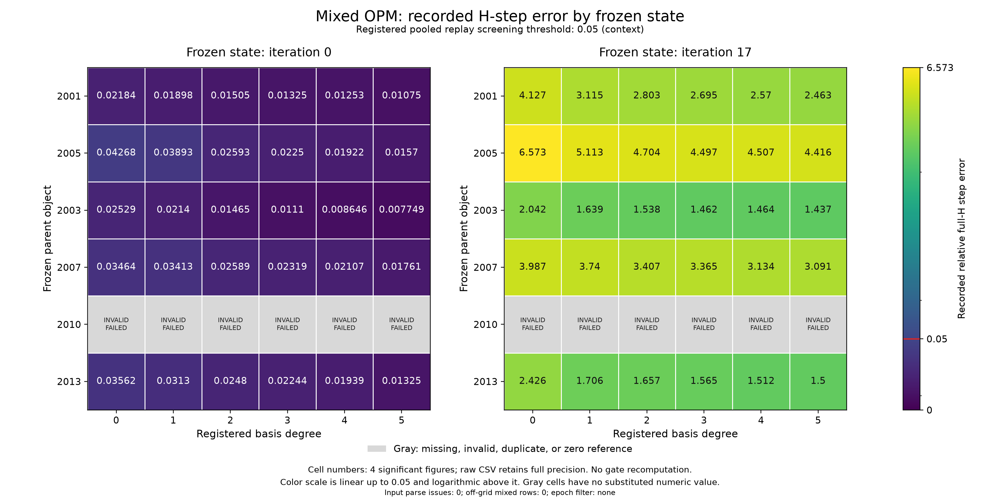

# A20 Route A 结果：当前实现不进入成像

本轮完成实现、注册 G0 检查及六对象/12 states 的 frozen replay。**当前实现进入 A1 的判断为 NO_GO；完整12-state H-step筛选为 HOLD。** 两者分别说明已观测的求解失败和完整参考不足。A1、A2、噪声成像、完整部署计时没有运行，不能宣布 G1 或 G2 通过，也不能将本轮结果解释为所有 OPM 表示无效。

## 合同与实现

保存的 A17/A9 DenseDDA 使用5184个 complex current坐标、六个照明、64个接收位置、k=2；Gaussian材料为54维实坐标，voxel为3456维。保持原材料度量、packing、极化率及导数、接收算子、直接求解器和complex128/float64。反馈为非线性极化率产生的 F，未以裸χ替换。

精确 Schur retained rank为8；O/P/M每类seed rank上限4。先汇集全部照明再压缩，O沿伴随链，P/M沿前向链，然后联合正交化形成嵌套空间。mixed degree0–5的实际rank为20/32/44/56/68/80，最高仅占full current dimension的1.54%。没有声称它们构成同一单Hessenberg递推。Galerkin核心同时检查尺度和条件数；显式 frozen-test Petrov及full fallback已实现、测试和计费，本次864个物理候选全部使用Galerkin，未发生full fallback。

材料步求解共同的受约束二次目标，而非先求无约束步再投影。旧步只有通过当前目标下的可行性及KKT审核才能成为参考。本轮3个saved参考通过，7个参考重新生成并通过，2个voxel新参考失败；新生成与审核全部计费。A1使用full state及近似J，A2使用冻结基底reduced state构造B；完整非线性执行器有tiny smoke证据，本轮六对象成像入口保持关闭。

公式—函数映射、缓存、fallback和信息边界见[后端映射](docs/BACKEND_MAP.md)。构基接收隔离视图；full J/H、真值与旧步只在独立offline评估范围打开。replay不将历史full步作为previous-accepted seed。公开runtime/offline数组键名及保存Q的support局限见[输入索引](docs/PUBLIC_PACKAGE_INDEX.md)。

## 完整性与真实失败

供给的代数检查20个random trials全部通过。tiny Maxwell检查在最后一轮26/26通过，七轮和五次失败均保留。原尺寸G0审核2001/2005的初始状态：最大记录代数/伴随误差约6.23e-13，四个预定差分步长有稳定平台并满足1e-5。移动基底遗漏项、frozen Petrov与moving least-squares区别、尺度/奇异core、零seed、gauge、材料real adjoint、stacking及缓存回归详见[测试清单](docs/G0_TEST_INVENTORY.md)。真实多频未运行；多频只在tiny k=0.9/1.25检查，实际pilot单频。

G0通过表示这些已执行检查通过，不保证高维优化器必然给出合格步。voxel初始full参考的KKT相对残差为 **2.64708e-8**：优化器报告收敛，但高于1e-8，故拒绝。晚期full参考在200次迭代达到上限，KKT残差 **0.0173369**，同样拒绝。可行性违例均为0；可行不等于二次最优。没有增加jitter、伪逆、post-clipping、容差或迭代上限。

全cohort有864个实际method候选：720个拥有合格QP及有效参考，128个QP失败，16个QP合格但无有效full参考。另有2个full参考失败，共130条QPFailure日志；24条NOT_RUN记录说明每state缺POD和更强goal-aware ROM输入。42条shared geometry/state/reference/U记录另留存；合计930条raw记录。所有失败均在2010的两个states。没有GPU OOM或full fallback；失败steps、实际KKT和费用保留。zero-reference、重复和oracle标志均为0。

## H-step结果

在同一材料坐标、baseline、ridge与metric下，以full Jacobian定义 H=JᵀJ+λI，比较受约束步的 `||δ−δ_ref||_H / ||δ_ref||_H`。reference H-norm floor在运行前固定为1e-12。受约束quadratic gap还含KKT线性项，不能一律写成半个H-error energy；原始结果单列两者及完整KKT审计。

下表只针对五个Gaussian对象的十个有效states，**不作为完整12-state gate**。数值是比例乘100后的百分数。

| degree | 实际rank | 初始中位误差 | 晚期中位误差 | 十state中位误差 | 最差误差 |
|---|---:|---:|---:|---:|---:|
| 0 | 20 | 3.46% | 398.66% | 104.24% | 657.32% |
| 1 | 32 | 3.13% | 311.48% | 83.89% | 511.32% |
| 2 | 44 | 2.48% | 280.27% | 78.19% | 470.44% |
| 3 | 56 | 2.24% | 269.51% | 74.24% | 449.69% |
| 4 | 68 | 1.92% | 257.04% | 74.25% | 450.65% |
| 5 | 80 | 1.33% | 246.33% | 72.72% | 441.65% |

每个degree都是五个初始state小于5%，五个晚期state大于5%。晚期参考H-norm范围约5.80e-4至3.63e-3，远高于1e-12；相应绝对H-step误差约1.76e-3至7.42e-3，不能将高相对误差归为零参考。degree4/5只提供已注册的诊断，没有自动扩大live矩阵。误差非严格单调，例如2005的degree4比degree3略差。

这个早晚差异说明低rank空间对初始步的适配不保证晚期受约束逆更新。小参考步可能放大近似J对更新方向的影响，这是解释性推测；本轮没有干预实验或唯一机制辨识，不能据此归因于某个stream或给出全局失败定理。原始absolute误差、full quadratic gap、full stationarity/KKT与one-step真值误差均保留；one-step真值指标未经闭环接受，不能当成最终成像质量。

## 对照与统计

已运行O/P/M单通道、O+M、balanced mixed、mixed12、forward-only、receiver/SOM、ordinary right-block Krylov及三个固定random seed，对照分实际rank和物理vector RHS两个轴。未padding rank、插值前沿或将failed full fallback变成有效ROM。所有phase/动作原值见[汇总表](results/summary/SUMMARY_REPORT.md)及[raw前沿](results/summary/FRONTIER_RAW.csv)。

严格同seed rank、同实际rank且两states完整的bootstrap只有12组可估：Gaussian mixed12对forward-only及ordinary Krylov，各六degrees，每组五parents做2000次cluster resampling。degree3 mixed相对Krylov的parent平均H-error差约−3.642（95%描述区间−4.889至−2.295）；相对forward-only约−0.0179（−0.0672至0.0500）。后者不支持清晰的独立伴随链收益判断。此处是rank/seed匹配，并非完整部署动作或墙钟匹配；不能据此宣布OPM加速或普遍优于通用ROM。balanced-total4及SOM/random等未满足该mixed12严格配对条件的组明确标不可估；rank-only观测另表保留，不补造CI。voxel只有一个parent且没有有效参考，未给总体显著性。

全部132个统计组，包括120个不可估组及缺失原因，都保留在[paired bootstrap表](results/summary/PAIRED_PARENT_BOOTSTRAP.csv)。数值仅描述历史暴露对象，不是blind或generalization证据。summary中的144个missing grid cells是缺POD/更强ROM在degree网格上的占位，不是144个额外未完成物理尝试；本次864个已注册可执行method候选均已尝试。

## Gate与费用

| 层级 | 判断 | 原因 |
|---|---|---|
| 已执行G0/backend检查 | PASS | 范围见测试清单，高维QP成功不是由tiny检查保证 |
| 当前生产QP/进阶 | NO_GO | 128个method及2个reference实际失败；无eligible degree |
| 完整12-state H筛选 | HOLD | voxel两个有效参考缺失，不在10-state子集上伪造完整median |
| Gaussian有效子集 | 负向证据 | 浅层及degree5的晚期H-step误差均大，未替代注册gate |
| G1非线性质量/A1/A2 | NOT_RUN | replay前置未过，0/42个主成像conditions |
| G2部署成本/cold-warm | NOT_RUN | 无matched-quality survivor，replay计时不能替代部署 |
| 噪声/POD/强ROM | NOT_RUN | 前置关闭或无合规现成输入 |

原replay job里的自动gate保留原样。其classifier在QP失败且reference缺失共存时曾对剩余10个参考计算median；修正后的离线gate将完整H-screen记HOLD，实际method failure仍为FAIL。五项无物理回归通过，未修改运行中的物理源码、QP或门槛。详见[冲突记录](docs/PROTOCOL_CONFLICTS.md)和[最终gate](results/GATE_DECISION.json)。

replay CPU为4473.671875秒，独占GPU elapsed为4688.1155205秒。全部工作总计GPU占用5375.9374196秒（89.60分钟），CPU计费低于90分钟，未突破GPU12小时或CPU2小时。总表包含参考、失败、七轮tiny检查、real G0、汇总及审计；其中失败launch没有进程回执，CPU/GPU各保守计501.975秒，动作次数未知而非0。120秒CPU preparation/transport/publication allowance明确是保守计费而非精确实测。峰值replay CPU RSS约4.73GB、GPU allocated约1.81GB/reserved约2.16GB。完整job墙钟和exclusive spans不可重复求和，degree basis trajectory也不可跨degrees累加。最终数字以[预算](results/BUDGET_FINAL.json)和[全部jobs](results/JOB_LEDGER.jsonl)为准。

## 可支持与不可支持的声称

可以支持：固定后端上的Schur/native-stream实现通过已执行完整性检查；给定8+4/4/4 seed/rank合同下，初始Gaussian frozen步误差较低而晚期明显恶化；degree4/5诊断未恢复这些晚期步；严格KKT审核揭示高维QP限制并阻止后续成像。

不能支持：六对象最终重建接近full GN、20%总部署加速、OPM优于所有ROM、NN-native贡献、真实多频性能、blind泛化、需接近full rank的定量结论，或所有未来OPM表示都无用。更高rank和不同合规seed合同未测。POD/强ROM与真实held receiver geometry未注册，明确缺失。

最近先例R04/R05已覆盖非线性反演中的reduced forward/J与ROM监测，因此不声称首次“ROM+GN”。[scholarqa-research审计](docs/CLOSEST_PRIOR_AUDIT.md)保留429检索缺口、全文/摘要访问层级及claim ledger；随机监测也不当作确定性full KKT证书。

没有训练NN，没有改变Maxwell solver，没有开展PCG/GMRES solver acceleration，也没有借用其他阶段预算继续campaign。若未来另行注册继续实验，首先需要在同一二次目标与原KKT门槛下获得可认证voxel参考；本轮未启动该后续工作。公开发布只是代码、输入与有界成功/失败证据的交付，发布状态单独见[发布回执](results/PUBLICATION.json)。
